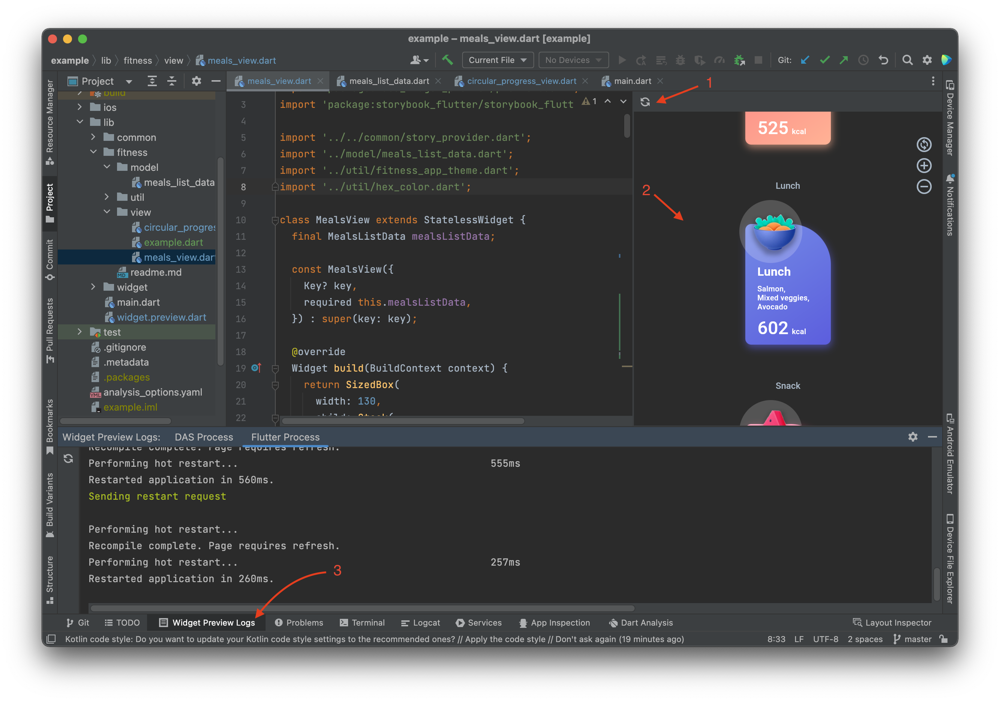

> # Deprecated
>
> Plugin is discontinued. It is disabled in the Jetbrains Marketplace.
>
> ---

# About

The aim of this plugin (pub package and IDE plugin) is to assist Flutter developers creating reusable UI components that are not tied to business logic.

## General

This repository contains:
- the open source code of the publicly available `idea_widget_preview` pub package
- usage documentation and required legal information for the [closed-source `Widget Preview for Flutter` plugin](https://plugins.jetbrains.com/plugin/20292-widget-preview-for-flutter).

## Demo

Here is an example what the plugin looks like in action:

https://user-images.githubusercontent.com/17592224/198992173-ff00ec49-47bc-478f-91f4-1667d1a78813.mov

(Widgets used in the demo were retrieved from [here](https://github.com/mitesh77/Best-Flutter-UI-Templates).)

# Table Of Contents

<!-- TOC -->
* [About](#about)
  * [General](#general)
  * [Demo](#demo)
* [Docs](#docs)
  * [Getting started](#getting-started)
    * [Prerequisites](#prerequisites)
    * [Your first preview](#your-first-preview)
    * [Transform file](#transform-file)
  * [Plugin ui](#plugin-ui)
<!-- TOC -->

# Docs

## Getting started

### Prerequisites

- [Install Flutter](https://docs.flutter.dev/get-started/install) on your machine
  - Add `flutter` tool to your path (preferred)
- Add `idea_widget_preview` pub package to your project
- [Install `Widget Preview for Flutter` plugin](https://plugins.jetbrains.com/plugin/20292-widget-preview-for-flutter) in your Jetbrains IDE

Recommended:
- Add `lib/widget.preview.dart` to your `.gitignore`

### Your first preview

This is what a typical setup looks like for a widget:

```dart
import 'package:flutter/material.dart';
import 'package:idea_widget_preview/preview.dart';

// 1) Your widget
class Example extends StatelessWidget {
  @override
  Widget build(BuildContext context) {
    return Container(
      width: 200,
      height: 200,
      color: Colors.amber,
    );
  }
}

// 2) The corresponding preview
class ExamplePreview extends PreviewProvider {
  @override
  List<Preview> get previews => [
        // 3) Individual declarations 
        Preview(
          title: "Simple",
          builder: (BuildContext context) {
            return Example();
          },
        )
      ];
}
```

As you can see from the previous code, there are 3 key things to keep in mind when declaring your preview:

1) Widget.
2) Public class declaration that derives from `PreviewProvider` and has a no-arg constructor.
3) Individual declarations you want to see in your Preview.

### Transform file

*(Advanced topic. It is worth reading it to know about this feature.)*

If you prefer to keep the dependency to `idea_widget_preview` minimal, or you already have a [storybook](https://pub.dev/packages/storybook_flutter)  configured in your project, there is alternative solution to extending or implementing the `PreviewProvider` class.

You can provide your custom implementation that converts your existing class to `PreviewProvider`. In the following example, `StoryProvider` is your custom class.

```dart
abstract class StoryProvider {
  List<Story> get stories;
}
```

```dart
class ConvertToPreviews implements ToPreviewProvider<StoryProvider> {
  @override
  PreviewProvider toPreviewProvider(StoryProvider value) {
    return PreviewProvider.createAnonymous(
      previews: value.stories
          .map(
            (story) => Preview(
                title: story.name,
                builder: story.builder,
            ),
          )
          .toList(),
    );
  }
}
```

With that in place, you can create your previews like this:

```dart
class MealsViewStory implements StoryProvider {
  @override
  final List<Story> stories = [
    Story(
      name: 'Widget/Breakfast',
      description: 'A preview about the breakfast.',
      builder: (context) =>
              MealsView(
                mealsListData: MealsListData.tabIconsList[0],
              ),
    ),
    // ...
  ];
}
```

> Very important:
> 
> You need to configure in IDEA settings (under `Widget Preview for Flutter` > `Transform file`) the path to the file where your implementation of `ToPreviewProvider` resides in.

## Plugin ui



1) Refresh: This button reloads the current preview.
2) This is the preview panel you can open in any `.dart` file. The content is context-dependent and in case of errors, or missing implementation, you will see a message instead of the preview.
3) Additional logs view of the running processes. If your project contains errors, the preview cannot be rendered. These 2 readonly console views provides further info about issues. (Ideally, IDEA and the Dart plugin will highlight the issues in your project anyway.)


